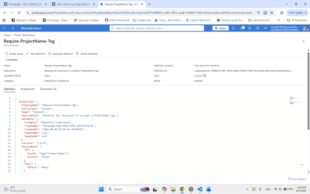
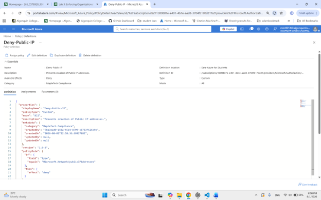
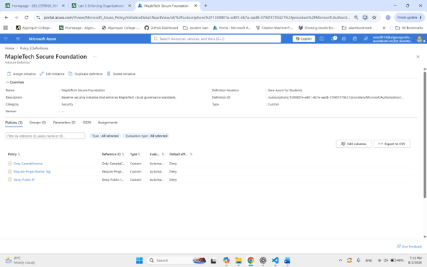
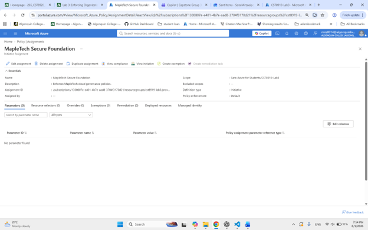
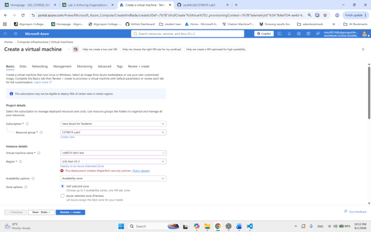
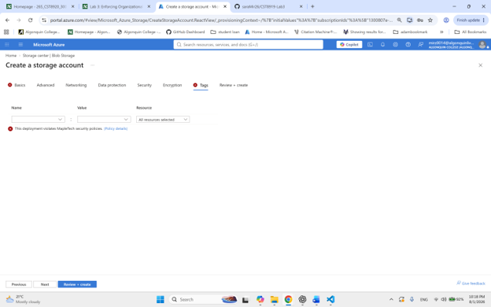
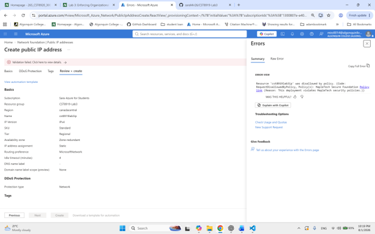
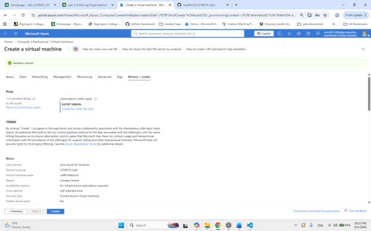

# CST8919 – Lab 3: Cloud Governance Gone Rogue – Azure Policy Lab

**Course:** CST8919 – DevOps Security and Compliance  
**Student:** Sara Mirzaei  
**Lab:** Cloud Governance Gone Rogue – Azure Policy Lab  

---

# Lab Summary

In this lab, I implemented Azure Policy to enforce organizational governance and security requirements for MapleTech Solutions. The objective was to prevent non-compliant Azure resource deployments by creating custom Azure Policies, grouping them into a Policy Initiative, and assigning the initiative to a resource group with enforcement enabled.

The implemented policies ensure that:

* Resources can only be deployed in the **Canada Central** region.
* Every resource must include a **ProjectName** tag.
* Azure **Public IP Address** resources cannot be created.

After assigning the initiative, I tested several deployment scenarios to verify that Azure Policy correctly denied non-compliant resources while allowing compliant deployments.

---

# Custom Policy Definitions

## Policy 1 – Only-CanadaCentral

### Purpose

This policy restricts resource deployments to the **Canada Central** Azure region.

### Effect

**Deny**

### Why this policy is important

Restricting deployments to approved regions helps organizations:

* Meet regulatory and compliance requirements
* Maintain data residency
* Reduce management complexity
* Standardize cloud deployments

### Expected Behavior

* Deployments in Canada Central → Allowed
* Deployments in any other Azure region → Denied

---

## Policy 2 – Require-ProjectName-Tag

### Purpose

This policy requires every Azure resource to include the **ProjectName** tag.

### Effect

**Deny**

### Why this policy is important

Mandatory tagging helps organizations:

* Track cloud resources
* Allocate costs to projects
* Improve reporting
* Support automation
* Simplify governance

### Expected Behavior

* Resource contains ProjectName tag → Allowed
* ProjectName tag missing → Denied

---

## Policy 3 – Deny-Public-IP

### Purpose

This policy prevents the creation of Azure Public IP Address resources.

### Effect

**Deny**

### Why this policy is important

Blocking Public IPs improves security by:

* Reducing the attack surface
* Preventing accidental internet exposure
* Enforcing secure network architecture

### Expected Behavior

* Public IP creation → Denied
* Other resource types → Evaluated by remaining policies

---

# Policy Initiative

## MapleTech Secure Foundation

To simplify policy management, the three custom policies were grouped into a single Azure Policy Initiative named:

**MapleTech Secure Foundation**

The initiative contains:

* Only-CanadaCentral
* Require-ProjectName-Tag
* Deny-Public-IP

Using an initiative makes governance easier by allowing multiple policies to be assigned and managed together.

---

# Policy Assignment

The initiative was assigned to the lab resource group with **Enforcement Mode** enabled.

Because the assignment uses the **Deny** effect, Azure immediately blocks any deployment that violates one or more policies instead of simply auditing the resource.

---

# Policy Testing

The following deployment scenarios were tested.

| Test Case                                                          | Expected Result | Outcome                                                                 |
| ------------------------------------------------------------------ | --------------- | ----------------------------------------------------------------------- |
| Deploy a Virtual Machine in East US                                | Denied          | Passed                                                                  |
| Deploy a Storage Account without the ProjectName tag               | Denied          | Passed                                                                  |
| Create a Public IP Address                                         | Denied          | Passed                                                                  |
| Deploy a compliant resource in Canada Central with ProjectName tag | Allowed         | Passed (or explain if Public IP policy prevented default VM deployment) |

---

# Screenshots

The following screenshots were captured during the lab:  

###  1. Custom Policy – Only-CanadaCentral   
    

### 2. Custom Policy – Require-ProjectName-Tag     
    

### 3. Custom Policy – Deny-Public-IP    
   

### 4. MapleTech Secure Foundation Initiative    
   

### 5. Initiative Assignment    
   

### 6. Deployment denied outside Canada Central   
   

### 7. Deployment denied because ProjectName tag was missing    
      
 
### 8. Public IP creation denied   
    

### 9. Successful compliant deployment   
     

---

# Challenges Encountered

One challenge encountered during testing was deploying an Azure Virtual Machine after all policies were enforced.

The Azure Portal VM creation wizard automatically creates a Public IP Address by default. Since the **Deny-Public-IP** policy blocks all Public IP resources, the VM deployment failed even when the correct region and required ProjectName tag were provided.

This behavior confirmed that Azure Policy was functioning correctly and enforcing organizational security requirements. To successfully deploy a virtual machine under these policies, the Public IP configuration must be removed or disabled during deployment.

---

# Lessons Learned

This lab provided practical experience with Azure Policy and cloud governance.

Key lessons learned include:

* How Azure Policy evaluates resources before deployment.
* The difference between auditing resources and denying deployments.
* The importance of Azure Policy Initiatives for managing multiple policies.
* How mandatory tagging supports governance and cost management.
* How Azure Policy improves cloud security by preventing risky configurations.
* The importance of testing policies using realistic deployment scenarios.

---

# Conclusion

Azure Policy provides an effective mechanism for enforcing organizational governance standards across Azure subscriptions and resource groups.

By creating custom policies, grouping them into an initiative, and assigning the initiative with enforcement enabled, I was able to automatically prevent non-compliant deployments. The testing demonstrated that Azure Policy can successfully enforce regional restrictions, mandatory resource tagging, and network security requirements, helping organizations maintain secure and compliant cloud environments.

---

# Video Demonstration

**Please click below to watch the demo video:**     

